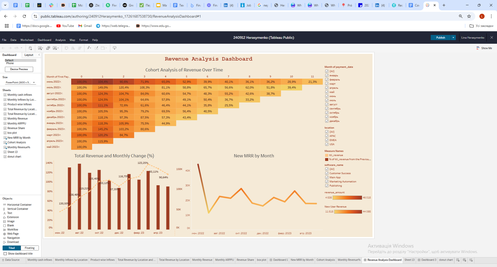

# Revenue Analysis Dashboard (Tableau)

**🎯 Goal**  
Analyze revenue, profit and product performance across categories, regions, and time periods.  

**📂 Data**  
Retail dataset (orders, customers, products). Data was cleaned and prepared before visualization.  

**📊 Key metrics**
- Revenue and Profit by month  
- Profit Margin  
- Top Products & Categories  
- Regional comparison  
- Cohort Analysis & Retention  

**🔎 Insights**
- Q4 shows **+18% growth** compared to Q3 (seasonal uplift).  
- Category X contributed the most to total profit.  
- Regional analysis revealed underperforming areas with lower margins.  
- Cohort analysis shows user revenue retention drops after 3–4 months.  

---

### 📊 Preview

---

### 🔗 Live Version
[View on Tableau Public](https://public.tableau.com/views/240912Herasymenko_17261687538730/RevenueAnalysisDashboard?:language=en-US&:sid=&:redirect=auth&:display_count=n&:origin=viz_share_link)

---

**🛠 Stack used:** Tableau, Google Sheets (data preparation)
