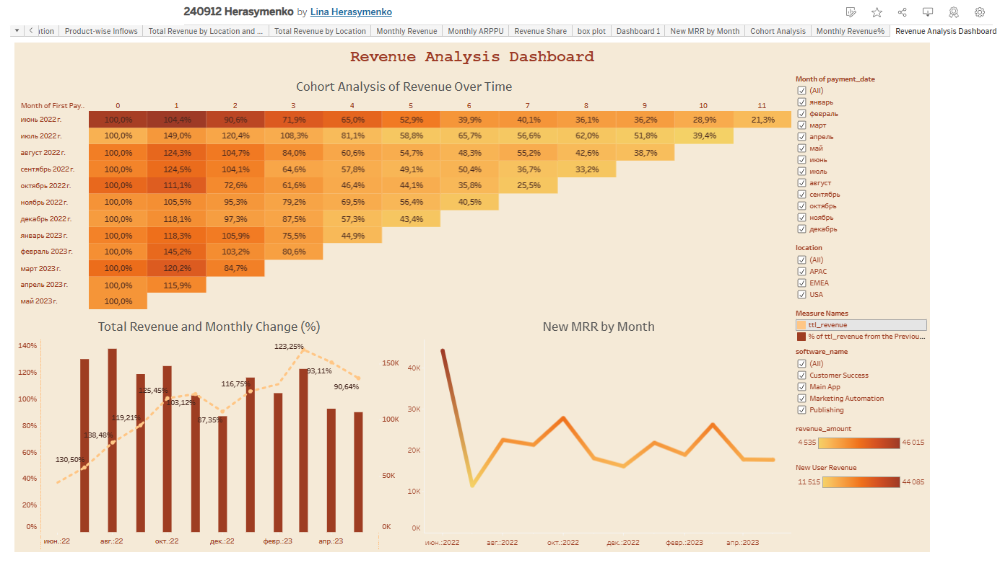

# Revenue Analysis Dashboard (Tableau)

## 🎯 Goal  
Analyze revenue, profit, and product performance across categories, regions, and time periods to identify business insights.  

## 📊 Data  
Retail dataset (orders, customers, products). Data was cleaned and prepared before visualization.  

## 🔑 Key Metrics  
- Revenue and Profit by month  
- Profit Margin  
- Top Products & Categories  
- Regional comparison  
- Cohort Analysis & Retention  

## 🔍 Insights  
- Q4 shows **+18% growth** compared to Q3 (seasonal uplift).  
- Category X contributed the most to total profit.  
- Regional analysis revealed underperforming areas with lower margins.  
- Cohort analysis shows user revenue retention drops after 3–4 months.  

## 🖼️ Preview  
  

## 🔗 Live Version  
[View on Tableau Public](https://public.tableau.com/views/240912Herasymenko_17261687538730/RevenueAnalysisDashboard?:language=en-US&:sid=&:redirect=auth&:display_count=n&:origin=viz_share_link)  

## 🛠️ Stack Used  
- Tableau  
- Google Sheets (data preparation)  
